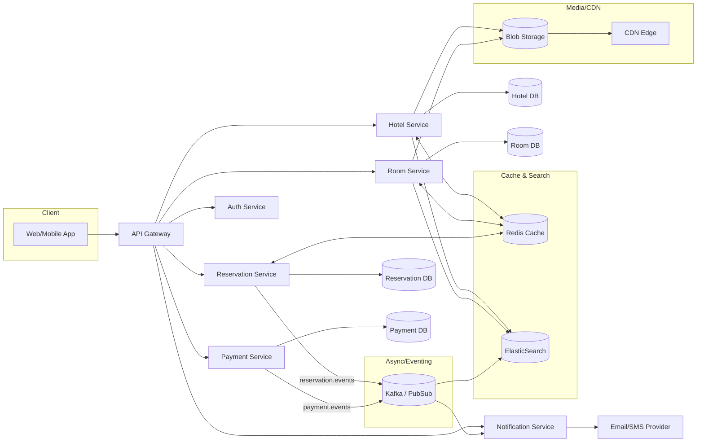
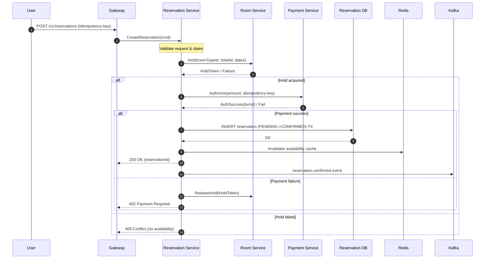
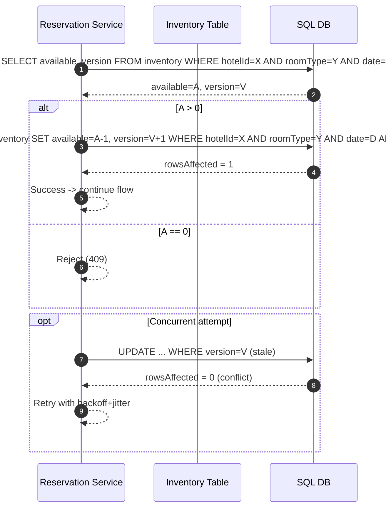
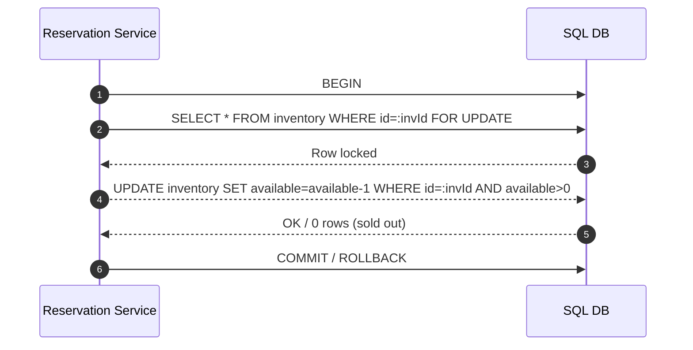
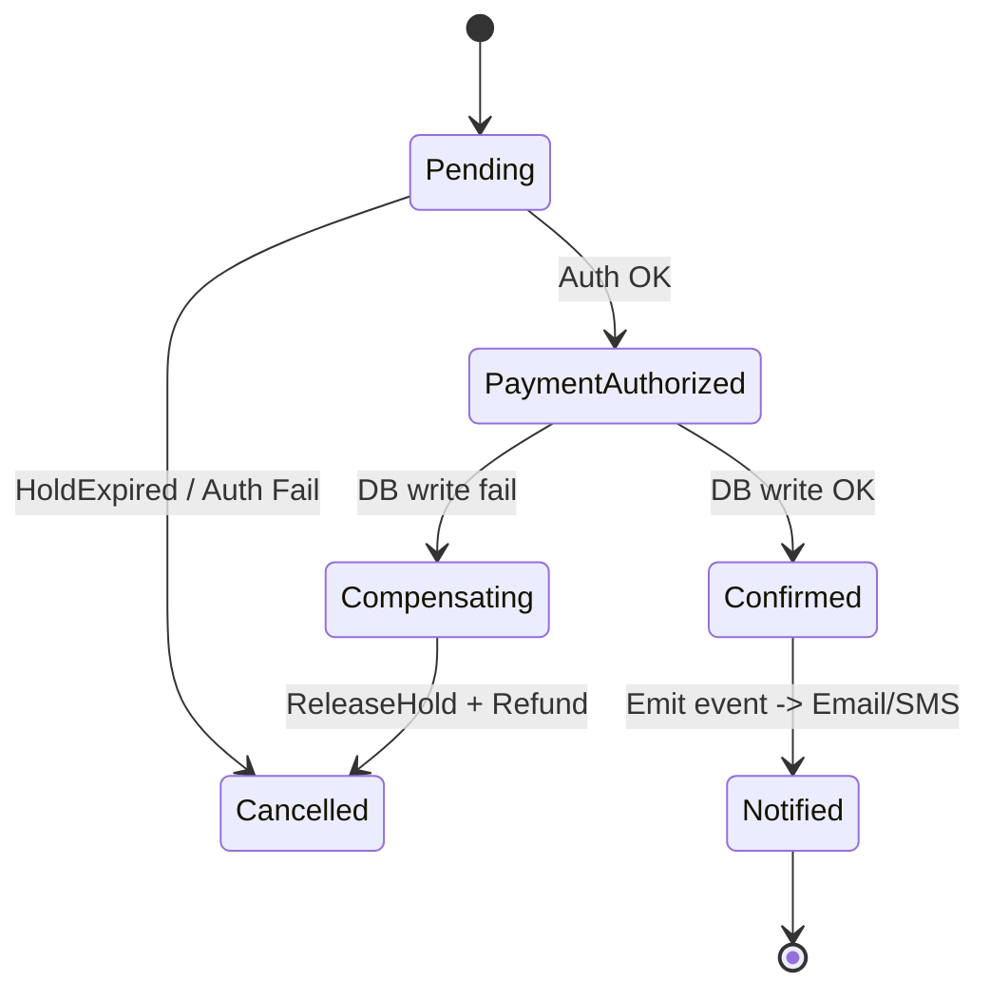
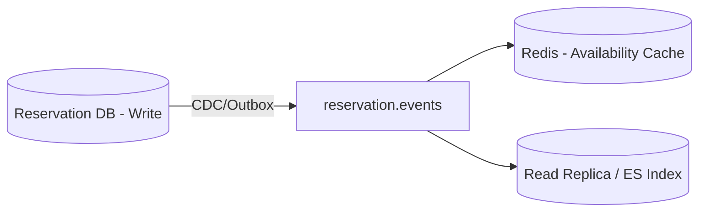

# 🏨 Hotel Reservation System - HLD (Interview Notes)

## 1. Problem Statement
Design a **Hotel Reservation System** (similar to Marriott, Booking.com, Airbnb) that allows:
- Browsing hotels and rooms.
- Making and managing reservations.
- Handling concurrency (multiple users booking the same room).
- Scaling to millions of users and hotels.

---

## 2. Requirements

### ✅ Functional
1. Search hotel (by city, date, price, amenities).
2. View hotel & room details.
3. Reserve a room.
4. Cancel / update reservation.
5. Admin operations (add/update hotel/room).

### ⚡ Non-Functional
- **Scalability** → Handle millions of rooms & concurrent bookings.
- **Availability** → Always bookable (99.99% uptime).
- **Consistency** → Prevent overbooking.
- **Latency** → Low response times (<200ms for search).
- **Reliability & Fault Tolerance** → Recover from crashes.
- **Concurrency** → Handle multiple people booking same room at same time.

---

## 3. Back-of-the-Envelope Estimations
- 5,000 hotels → 1M rooms.
- 70% occupancy → ~700K active reservations daily.
- Avg stay: 3 days → ~233K bookings/day.
- Per second: ~3 bookings/sec (peak × 10 = 30/sec).

---

## 4. API Design (RESTful)

### 🔹 Hotel APIs
```http
GET    /v1/hotels/{id}
POST   /v1/hotels
PUT    /v1/hotels/{id}
DELETE /v1/hotels/{id}
```
### 🔹 Room APIs
```http
GET    /v1/hotels/{id}/rooms/{roomId}
POST   /v1/hotels/{id}/rooms
PUT    /v1/hotels/{id}/rooms/{roomId}
DELETE /v1/hotels/{id}/rooms/{roomId}
```
### 🔹 Reservation APIs
```http
GET    /v1/reservations
GET    /v1/reservations/{id}
POST   /v1/reservations
DELETE /v1/reservations/{id}
```
```json
{
  "hotelId": 123,
  "roomTypeId": "DELUXE",
  "startDate": "2025-09-01",
  "endDate": "2025-09-05",
  "userId": 987
}

```
### 🔹 Search API
```http
GET /v1/search?city={city}&checkin={date}&checkout={date}&priceMin={min}&priceMax={max}&amenities={amenities}
```
### 🔹 User APIs
```http
POST   /v1/users
GET    /v1/users/{id}
PUT    /v1/users/{id}
DELETE /v1/users/{id}
```
### 🔹 Authentication APIs
```http
POST /v1/auth/login
POST /v1/auth/register
POST /v1/auth/logout
``` 
### 🔹 Admin APIs
```http
POST   /v1/admin/hotels
PUT    /v1/admin/hotels/{id}
DELETE /v1/admin/hotels/{id}
POST   /v1/admin/hotels/{id}/rooms
PUT    /v1/admin/hotels/{id}/rooms/{roomId}
DELETE /v1/admin/hotels/{id}/rooms/{roomId}
GET    /v1/admin/reservations
```
### 🔹 Payment APIs
```http
POST /v1/payments
GET  /v1/payments/{id}
```     
### 🔹 Notification APIs
```http
POST /v1/notifications/email
POST /v1/notifications/sms
```
```markdown
## 5. Data Modeling

### Relational DB (SQL) – For Consistency

- **Hotel** (`id`, `name`, `address`, `location`)
- **Room** (`id`, `hotelId`, `type`, `price`, `status`)
- **Reservation** (`id`, `userId`, `hotelId`, `roomId`, `startDate`, `endDate`, `status`)
- **User** (`id`, `name`, `email`, `loyaltyPoints`)

### NoSQL – For Scalability (Search, Caching)

- Room availability index (by hotel, date)
- Reservation history per user

---

### Why SQL DB over NoSQL for Core Design?

- **Strong Consistency:** SQL databases provide ACID properties, ensuring no overbooking and accurate reservations.
- **Complex Relationships:** Hotel, room, reservation, and user entities have clear relationships, easily modeled with foreign keys and joins.
- **Transactional Support:** Multi-step operations (e.g., booking, payment) require atomic transactions, which SQL handles natively.
- **Data Integrity:** Constraints and schemas enforce data validity, reducing errors.
- **Mature Querying:** SQL supports complex queries and reporting, useful for analytics and admin operations.

*NoSQL is used for high-speed search, caching, and denormalized views, but core transactional data benefits from SQL’s consistency and integrity guarantees.*
```
---## 6. System Design Diagram

```text
Clients → LB → API Gateway
         → Hotel Service → Hotel DB
         → Room Service → Room DB
         → Reservation Service → Reservation DB
         → Payment Service → Payment DB
         → CDN for static content
         
```
* Caching → Redis (hotel/room details).
* Search Index → ElasticSearch for querying hotels.
* Blob Storage → For hotel images.
* Sharding → HotelId % N → Distribute across DBs.
* Event Bus (Kafka) → For reservation events.

---

## 7. Concurrency Problems & Solutions

### Problem 1: Same user clicks "Book" multiple times

**Solution:**  
Idempotent API (use `reservationId` as an idempotency key to prevent duplicate bookings).

### Problem 2: Multiple users try to book the same room

**Solutions:**
- **Pessimistic Locking:** Lock the row until the transaction finishes.
- **Optimistic Locking:** Use version/timestamp; retry if there is a version mismatch.
- **Database Constraints:** Enforce `CHECK (availableRooms >= 0)` to prevent overbooking.

---

## 8. Algorithms & Techniques

### 🔹 Idempotent API
- Ensures the same request does not create duplicate bookings.
- **Example:** Stripe, PayPal use idempotency keys for payments.

### 🔹 Pessimistic Locking
- Row is locked until the transaction finishes.
- Prevents overbooking but reduces throughput.

### 🔹 Optimistic Locking
- Uses version numbers or timestamps.
- If version mismatch, retry the operation.
- Higher throughput, but may require retries.

### 🔹 Sharding
- Partition data by `HotelID` or region.
- **Example:** Marriott hotels in EU vs US stored separately.

### 🔹 CQRS (Command Query Responsibility Segregation)
- Writes go to the Reservation DB.
- Reads are served via cache/replica.
- **Example:** Airbnb, Uber.

### 🔹 Saga Pattern
- For distributed transactions (e.g., booking + payment).
- Reservation marked as "pending" until payment is confirmed.

---

## 9. Tradeoffs & Tweaks

- **Consistency vs Availability:**  
  Use strong consistency for booking, eventual consistency for search.
- **SQL + NoSQL Hybrid:**  
  Strong ACID guarantees in reservations, high-scale search in ElasticSearch.
- **Caching Strategy:**  
  LRU eviction, write-through for reservations.
- **Retry with Exponential Backoff:**  
  For optimistic locking conflicts.
- **Event-Driven Compensation:**  
  For handling cancellations and failed payments.

---

## 10. What Interviewers Look For

- **Requirement Gathering:** Did you clarify functional and non-functional needs?
- **Scale Estimation:** Can you do back-of-the-envelope math?
- **API & Data Model:** Did you design extensible, RESTful APIs?
- **System Design Principles:** Caching, DB choice, sharding, load balancing.
- **Consistency & Concurrency Handling:** Prevent overbooking with ACID.
- **Tradeoffs:** Can you justify SQL vs NoSQL, optimistic vs pessimistic locking?
- **Resilience:** Circuit breakers, retries, failover handling.
- **Security:** Data encryption, secure APIs (OAuth/JWT).
- **Real-world Parallels:** Can you relate design to systems like Airbnb, Marriott, Booking.com?

---

## 11. Example Interview Tweaks

- **Q:** What if Marriott has 100M rooms worldwide?  
  **A:** Introduce geo-sharding and CDN-based caching.

- **Q:** How to handle cancellations?  
  **A:** Use soft deletes and event-driven compensation workflows.

- **Q:** What if payment fails midway?  
  **A:** Use the Saga Pattern (reservation marked "pending" until payment is confirmed).

---
##  Key Design Considerations
1. **Concurrency Control** → Pessimistic locking or optimistic concurrency for booking.
2. **Caching** → Redis for frequently accessed data (hotel/room details).
3. **Search Optimization** → ElasticSearch for fast hotel searches.
4. **Scalability** → Horizontal scaling of services, DB sharding.
5. **Fault Tolerance** → Circuit breakers, retries, and fallbacks.
6. **Monitoring & Logging** → Track system health and user activity.
7. **Security** → Encrypt sensitive data, secure APIs with OAuth/JWT.
8. **Payment Integration** → Support multiple payment gateways.
9. **Notification System** → Email/SMS for booking confirmations and reminders.
10. **Admin Panel** → For hotel/room management and reporting.
11. **Data Backup & Recovery** → Regular backups and disaster recovery plans.
12. **Rate Limiting & Throttling** → Prevent abuse and ensure fair usage.
13. **GDPR Compliance** → Handle user data according to regulations.
14. **Multi-language & Currency Support** → For global users.
15. **Loyalty Programs** → Reward frequent users with points and discounts.

---## 12. Real-world Examples
- **Airbnb:** Peer-to-peer lodging with dynamic pricing.
- **Booking.com:** Extensive hotel listings with user reviews.
- **Marriott:** Large hotel chain with loyalty programs.
- **Expedia:** Bundled travel services (flights + hotels).
- **Hotels.com:** Focus on hotel bookings with rewards.
- **Trivago:** Hotel price comparison across multiple platforms.
- **Agoda:** Strong presence in Asia with competitive pricing.
- **Priceline:** Name-your-own-price model for hotel bookings.
- **Kayak:** Meta-search engine for travel bookings.
- **TripAdvisor:** User-generated reviews and hotel recommendations.
- **Hilton:** Global hotel chain with a focus on business travelers.
- **Hyatt:** Luxury hotel brand with personalized services.
- **OYO Rooms:** Budget hotel chain with standardized amenities.
- **Couchsurfing:** Community-based lodging with free stays.
- **Hostelworld:** Specializes in hostel bookings for budget travelers.
- **Travelocity:** Comprehensive travel booking platform.
- **Orbitz:** Online travel agency with a focus on US travelers.
- **Lastminute.com:** Deals on last-minute hotel bookings.
- **Google Hotel Search:** Aggregates hotel listings from various sources.
- **Trip.com:** Leading travel service provider in Asia.

---
---

# 🚀 Add-ons & Advanced Considerations

## 1. Reliability & Fault Tolerance
- **Circuit Breaker** → Prevent cascading failures if Payment Service/DB is down.
- **Retry with Backoff** → For transient failures (network issues).
- **Failover DB replicas** → Master-Slave or Leader-Follower.
- **Graceful degradation** → If recommendation service fails, still allow booking.

---

## 2. Event-Driven Architecture
- Use **Kafka / Kinesis** for:
   - Reservation confirmed → Trigger email/notification service.
   - Payment failed → Trigger cancellation event.
   - Room availability update → Notify Search Index service.
- Ensures **loose coupling** and **async processing**.

---

## 3. Monitoring & Observability
- **Metrics**: Bookings/sec, Failures/sec, DB latency, Cache hit ratio.
- **Logging**: Trace by reservationId (use correlation IDs).
- **Distributed Tracing**: Jaeger / Zipkin for debugging microservice flow.
- **Dashboards**: Grafana + Prometheus.

---

## 4. Security & Compliance
- **Authentication**: OAuth2 / JWT for APIs.
- **Authorization**: RBAC (Admin vs Customer).
- **PCI DSS compliance**: For handling payments.
- **Data Encryption**: TLS in transit, AES at rest.
- **Rate Limiting**: Protect APIs from abuse (e.g., search spam).

---

## 5. Performance Optimizations
- **Write-through cache** → Update Redis + DB for reservation confirmation.
- **Read replicas** → Serve search queries from replicas, not primary DB.
- **ElasticSearch** → Full-text search on hotels/amenities.
- **CDN** → Serve hotel images, static content.
- **Hot Partitioning** → Detect hotels with extremely high traffic (e.g., conference city) and rebalance shards.

---

## 6. Scalability Enhancements
- **Geo-Sharding**: Split DBs by region (US, EU, APAC).
- **Multi-Region Deployment**: Active-Active setup with global load balancer (Cloudflare, AWS Route53).
- **Autoscaling**: Horizontal scaling of Reservation service under load.
- **Async Payment Confirmation**: Don’t block booking flow if payment takes time.

---

## 7. Advanced Patterns
- **Saga Pattern**: Manage distributed transactions (Booking + Payment + Notification).
- **CQRS**: Separate read/write models (fast search vs consistent booking).
- **Event Sourcing**: Maintain history of all booking state changes (auditability).
- **Bulkhead Isolation**: Contain failures (if payment fails, search service unaffected).

---

## 8. Interview-Winning Insights
- Always highlight **Consistency vs Availability tradeoff**:
   - *Booking = Strong Consistency (ACID).*
   - *Search/Recommendation = Eventual Consistency.*
- Show **real-world analogies**: “Airbnb uses ElasticSearch for listings, Stripe-like idempotency keys for payments.”
- Stress on **failure handling**: *“What happens if payment succeeds but reservation DB write fails?” → Saga rollback.*
- Discuss **growth path**: Start with monolith → modularize → microservices → geo-distributed system.

---
---

# 🧭 Mermaid Diagrams & Quick Extras (Hotel Reservation System)

## 1) High-Level Architecture (Microservices)


## 2) Sequence Diagram - Booking Flow


## 3) Optimistic Locking on Availability (RoomType Inventory)

## 4) Pessimistic Locking on Availability (RoomType Inventory)

### 5) Saga Pattern (Reservation + Payment + Notification)

## 6) CQRS Pattern (Read/Write Separation)

* Outbox ensures “write + publish” is atomic (avoids phantom successes/failures).
* Read side is eventually consistent; booking write path is strongly consistent.

### 7) Capacity Planning Cheat Sheet
* Occupancy ≈ rooms * 0.7
* Daily bookings ≈ occupancy / avgStayDays
* Peak QPS ≈ dailyBookings / 86400 * 10
* Cache hit target: ≥ 90% for search & hotel details
* P99 latency targets: Search < 300ms, Create booking < 800ms (excluding long payments)

### 8) Idempotent API – Minimal Pseudocode
```json
   handleCreateReservation(req):
   key = req.headers["Idempotency-Key"]
   if key is missing: return 400

if entry := IdempotencyStore.get(key):
return entry.response  // exact replay

// store 'in-flight' marker to prevent duplicates
IdempotencyStore.putIfAbsent(key, {status: IN_PROGRESS, ts: now()})

try:
result = processBooking(req)  // includes hold + auth + insert
IdempotencyStore.put(key, {status: DONE, response: result})
return result
catch e:
// store error response too (to make retries deterministic)
IdempotencyStore.put(key, {status: DONE, response: mapError(e)})
throw
```
### 9) Availability Table (Per-Day Inventory) – SQL Sketch
```SQL
   CREATE TABLE room_inventory (
   hotel_id    BIGINT,
   room_type   TEXT,
   date        DATE,
   available   INT NOT NULL,
   version     BIGINT NOT NULL DEFAULT 0,
   PRIMARY KEY (hotel_id, room_type, date)
   );
```
### Optimistic decrement
```SQL
UPDATE room_inventory
SET available = available - 1, version = version + 1
WHERE hotel_id = :h AND room_type = :rt AND date = :d
AND available > 0 AND version = :v;
```

### 10) What to Say if Asked “Scale to 100M Rooms?”

* Geo-shard by region; route users via GSLB/Anycast to nearest region.
* Put inventory in region-local primaries; cross-region reads via replicas.
* Use time-bucketed partitions (date as partition key) to keep hot ranges small.
* Hot city surge → spillover shards + adaptive throttles on search.
* Multi-CDN for images; Edge KV for static hotel metadata.