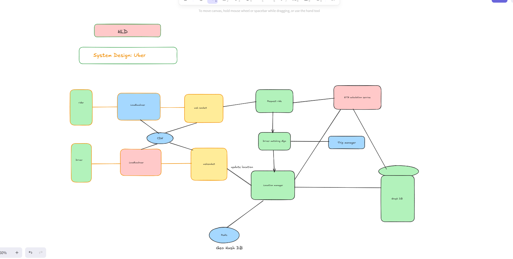

# Uber HLD (System Design for MAANG Interviews)

This document serves as a **revision guide** for Uber’s High-Level Design (HLD), specifically tailored for **SDE-2 interviews** at MAANG companies. It consolidates requirements, estimations, design components, and algorithm explanations in a structured manner.

---

## 1. Problem Statement

Design a **Taxi Aggregator Service (Uber-like)** system:

* Drivers register with the platform.
* Riders request rides from source → destination.
* System matches nearby drivers and manages trip lifecycle.

---

## 2. Requirements

### Functional Requirements

1. **Finding nearby drivers**
2. **Calculating & showing driver’s ETA (Estimated Time of Arrival)**
3. **Pricing logic** (including dynamic pricing/surge pricing)
4. **Request a ride**
5. **Updating driver’s real-time location**

### Non-Functional Requirements

1. **Availability** – System must be highly available (24x7).
2. **Scalability** – Handle millions of requests/day.
3. **Consistency** – Ride allocation and payment must remain consistent.
4. **Reliability** – Ensure correctness of matching and payments.

---

## 3. Back of the Envelope Estimation

### Daily Volume

* \~20M rides/day
* \~20M active riders
* \~3M active drivers

### Storage Estimation

* Driver Info (\~5M drivers) ≈ **5 GB**
* Trip Metadata (100 bytes/ride × 20M rides) ≈ **2 GB/day**
* 5000 new drivers/day ⇒ Growth rate must be handled.

### Peak Traffic

* Peak = 30% of rides in rush hour ⇒ \~6M rides in short window.

---

## 4. High-Level Architecture

### Core Components

1. **Load Balancer** → Distributes requests from Riders & Drivers.
2. **WebSockets** → For real-time driver location updates.
3. **Location Manager** → Manages driver geolocation data.
4. **Driver Matching Algorithm** → Finds optimal nearby drivers.
5. **ETA Service** → Estimates time based on distance, traffic, and route.
6. **Trip Manager** → Handles trip lifecycle (start, update, end).
7. **GeoHash DB (Redis)** → Stores driver coordinates efficiently.
8. **Graph DB** → Stores road networks for ETA & shortest path.

### Workflow

* Rider requests a ride → LoadBalancer → Request Service.
* Location Manager fetches nearby drivers from **GeoHash**.
* Driver Matching Algorithm selects best driver.
* ETA Service computes time & sends estimate.
* Trip Manager maintains trip state.

---

## 5. Algorithms & Data Structures

### 5.1 Geohashing (Finding Nearby Drivers)

* The Earth is divided into grid-like cells using **Geohash**.
* Each driver’s location is stored in Redis using `GEOADD`.
* To find nearby drivers:

  ```sql
  GEORADIUS location <lat> <lon> <radius> WITHDIST
  ```
* Efficient O(log n) lookup for spatial queries.

✅ Advantage: Reduces search space (instead of checking all drivers).

---

### 5.2 ETA Calculation (Estimated Time of Arrival)

* Uses **Graph DB (e.g., Neo4j)** for road networks.
* Factors:

    * Road distance
    * Traffic data
    * Historical driver speed profiles
* Algorithm:

    * **Dijkstra’s Algorithm / A* Search*\* for shortest path.
    * ETA = Distance ÷ Avg Speed (adjusted with traffic models).

✅ Tradeoff: A\* is faster than Dijkstra for real-time ETA.

---

### 5.3 Dynamic Pricing (Surge Pricing)

* Formula depends on:

    * **Demand/Supply Ratio** (active riders ÷ available drivers).
    * Traffic intensity.
    * Historical ride completion rates.

Example:

```
Final Price = Base Fare × Surge Multiplier
where Surge Multiplier = f(demand/supply, traffic)
```

✅ ML Models can improve accuracy of surge prediction.

---

### 5.4 Driver Matching Algorithm

Options:

1. **Nearest Driver (Greedy)** – Select closest driver.
2. **ETA-based Matching** – Select driver with lowest ETA (accounts for traffic).
3. **Load-Balanced Matching** – Distribute requests to avoid overloading drivers in high-demand zones.

✅ Optimal Approach = ETA + Surge + Driver Utilization balancing.

---

## 6. System Design Diagram

### Simplified Flow

```
 Rider ----> LB ----> Request Ride ---> Driver Matching Algo ---> Location Manager ---> Redis (GeoHash DB)
         |                          |                        |---> Graph DB (Road Network)
         |                          |----> ETA Service
 Driver ----> LB ----> WebSockets ---> Location Manager ---> Trip Manager
```

---

## 7. Scaling Considerations

1. **Sharding by Geohash Prefix** → Store drivers per region.
2. **Caching Hot Locations** → High-demand areas cached in Redis.
3. **Event-Driven Updates** → Kafka/RabbitMQ for ride state changes.
4. **CDN for Static Data** → Maps, route tiles, etc.

---

## 8. Trade-offs & Interview Talking Points

* **Consistency vs Latency**: Rider sees approximate ETA, not always exact.
* **Availability vs Accuracy**: Always return *some* driver instead of waiting.
* **Storage Growth**: Need efficient archiving of old trip data.
* **Real-time updates**: Drivers push location every 2-5 seconds → Bandwidth optimization needed.

---

## 9. Key Interview Insights

* **Geohash + Redis** is the industry standard for nearby search.
* **ETA = Shortest Path Problem** → Dijkstra, A\*, ML models.
* **Dynamic Pricing = Demand-Supply balancing**.
* **Peak Load Handling** = Scale using sharding, partitioning, async queues.
* **Reliability** = Retry mechanisms + eventual consistency for trip updates.

---


[//]: # (![Uber Design]&#40;./Uber.png&#41;)

These are additional points to strengthen the Uber HLD notes and make your interview answers stand out.

---

## 1. API Design
- **POST /rider/requestRide** → Request a ride
- **POST /driver/updateLocation** → Driver updates location
- **GET /rider/nearbyDrivers** → Get nearby drivers
- **GET /ride/{rideId}/eta** → Get ETA for a trip
- **POST /ride/{rideId}/end** → End trip

---

## 2. Real-Time Communication
- **WebSockets** (bi-directional) for Rider ↔ Driver communication.
- **Fallback**: Long polling when WebSockets fail.
- **Kafka/RabbitMQ** for async updates (surge pricing, trip state changes).

---

## 3. Location Update Optimization
- Drivers send location every **2–5 seconds**.
- To optimize bandwidth:
    - Send only when driver moves > X meters.
    - Use **Delta Encoding** (send changes instead of full lat-long).

---

## 4. Data Partitioning
- **Geohash prefix-based sharding** for location storage.
- Cache high-demand areas (e.g., airports, city centers).
- Trips DB partitioned by `rideId % N` or region.

---

## 5. Fault Tolerance & Reliability
- **At-least-once delivery** with Kafka.
- **Retry logic** for failed updates.
- **Fallback driver selection**: if best driver doesn’t accept, reassign quickly.

---

## 6. Security & Payments
- **OAuth2.0 / JWT** for authentication.
- **PCI compliance** for payments.
- Dedicated **Payment Microservice** with retries & ledgers.

---

## 7. Advanced ETA
- **A* search with traffic weights** (faster than Dijkstra).
- ML models for **historical traffic adjustments**.
- Real-world: Uber uses ML-driven ETA correction.

---

## 8. Monitoring & Metrics
- Latency of APIs (findNearbyDrivers, requestRide).
- Trip allocation success rate.
- ETA prediction accuracy.
- Driver utilization metrics.

---

## 9. Capacity Planning (Numbers)
- **20M rides/day** → ~230 rides/sec sustained.
- **Peak traffic**: 6M rides/hour → ~1666 rides/sec.
- Metadata = ~2 GB/day growth.
- Location updates: 3M drivers × every 5 sec → ~600K updates/sec.

---

## 10. Extra Talking Points
- **Consistency vs Latency trade-off**: Stale location allowed for speed.
- **Event-driven architecture**: decoupled microservices.
- **Graph DB vs Pre-computed shortest paths**: performance trade-off.
- **Always return a driver**: even approximate, for UX reliability.

---